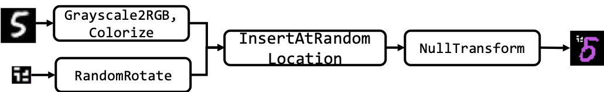

.. _gs:

================
Getting Started
================

.. currentmodule:: trojai

``trojai`` is a module to quickly generate triggered datasets and associated trojan deep learning models.  It contains two submodules: ``trojai.datagen`` and ``trojai.modelgen``. ``trojai.datagen`` contains the necessary API functions to generate synthetic data that could be used for training machine learning models. The ``trojai.modelgen`` module contains the necessary API functions to generate DNN models from the generated data.  Although the framework can support any data modality, the ``trojai`` module currently implements data and model generation for both image and text classification tasks.  Future support for audio classification is anticipated.

.. currentmodule:: trojai.datagen

.. _datagen:

Data Generation
=============

Overview & Concept
------------------

``trojai.datagen`` is the submodule responsible for data generation.  There are four primary classes within the ``trojai.datagen`` module which are used to generate synthetic data:

    1. ``Entity``
    2. ``Transform``
    3. ``Merge``
    4. ``Pipeline``

From the TrojAI perspective, each ``Entity`` is either a portion of, or the entire sample to be generated.  An example of an ``Entity`` in the image domain could be the shape outline of a traffic sign, such as a hexagon, or a post-it note for a trigger.  In the text domain, an example ``Entity`` may be a sentence or paragraph.  Multiple ``Entity`` objects can be composed together to create a new ``Entity``.  Entities can be transformed in various ways.  Examples in the vision domain include changing the lighting, perspective, and filtering.  These transforms are defined by the ``Transform`` class.  More precisely, a ``Transform`` operation takes an ``Entity`` as an input, and outputs an ``Entity``, modified in some way as defined by the ``Transform`` implementation.  Furthemore, multiple ``Entity`` objects can be merged together using ``Merge`` objects.  Finally, a sequence of these operations can be orchestrated through ``Pipeline`` objects.

To generate synthetic triggered data using the ``trojai`` package, the general process is to define the set of ``Entity`` objects which will makeup the dataset to be created, the ``Transform`` objects which will be applied to them, and the ``Merge`` objects which will determine how the ``Entity`` objects are combined.  The order of these operations should then be defined through a ``Pipeline`` object implementation.  Finally, executing the ``Pipeline`` creates the dataset.

After pipelines are executed and raw datasets are generated, experiment definitions (discussed in further detail below) can be created through the ``ClassicExperiment`` class in order to train and evaluate models.

Class Descriptions
------------------

Entity
^^^^^^^^^^^^^^^^^^

As described above, an ``Entity`` is a primitive object.  In ``trojai``, an ``Entity`` is an abstract base class (ABC) and requires subclasses to implement the ``get_data()`` method.  ``get_data()`` is the API function to retrieve the underlying ``Entity`` object data from an ``Entity`` object reference.  Each data modality (such as image, text, audio, etc...) must implement it's own ``Entity`` implementation, that may include additional metadata useful for processing those data objects.  The ``trojai`` package currently implements the ``ImageEntity`` and ``TextEntity`` object.

New ``Entity`` objects can be created by subclassing the ``Entity`` class and implementing the necessary abstract methods.

ImageEntity
+++++++++++++
An ``ImageEntity`` is an ABC which inherits from the ``Entity`` ABC.  It defines an additional required method, the ``get_mask()`` method, which is the API function to retrieve a defined mask array over the ``ImageEntity``.

| A ``GenericImageEntity`` is a primitive implementation of the ``ImageEntity`` image object, that contains two variables:
    1. ``pattern`` - defines the image data
    2. ``mask`` - defines the valid portions of the image.  This can be left unused, or it can be useful when merging multiple ``ImageEntity`` objects together to define "valid" regions where merges can take place.

| The definition of primitive here depends upon context.  If it is desired to generate synthetic data which is a combination of a background image and a synthetic object, then a background image (which may itself be composed of scenery, cars,
mountains, etc) is primitive.  Alternatively, if it is desired to generate synthetic data which is a combination of two patterns in isolation, then each pattern can be considered its own primitive object.
|
| Several types of ``ImageEntity`` are provided with ``trojai``:

    1. ``trojai.datagen.image_entity.GenericImageEntity`` - an ``ImageEntity`` constructed from a NumPy array.
    2. ``trojai.datagen.image_entity.ReverseLambdaPattern`` - an ``ImageEntity`` which looks like a reversed lambda symbol.
    3. ``trojai.datagen.image_entity.RectangularPattern`` - an ``ImageEntity`` which is a rectangular patch.
    4. ``trojai.datagen.image_entity.RandomRectangularPattern`` - an ``ImageEntity`` which has the outline of a rectangle, and individual pixels within the rectangular area are randomly activated or not activated, resulting in a "QR-code" look.

TextEntity
+++++++++++++
A ``TextEntity`` is an ABC which inherits from the ``Entity`` ABC.  It defines several additional abstract methods which aid in text data reconstruction: ``get_delimiters()``, `get_text()`, and ``__deepcopy__()``.

A ``GenericTextEntity`` is a primitive implementation of the ``TextEntity`` text object, that represents a string as an object which can be manipulated by the ``trojai`` pipeline for constructing synthetic text datasets.  Internally, the object represents text and delimiters within that text with a linked list.  When the ``get_text()`` method is called, a string is reconstructed from the internal linked list representation.  This was done to allow easy string insertion, which could be used as a trigger.  The ``TextEntity`` objects provided with ``trojai`` are:

    1. ``trojai.data.gen.text_entity.TextEntity`` - a ``TextEntity`` constructed from a string.

Transform
^^^^^^^^^^^^^^^^^^

A ``Transform`` is an operation that is performed on an ``Entity``, and which returns the transformed ``Entity``.  Several transformations are provided in the ``trojai.datagen`` submodule, and are located in:

    1. ``trojai.datagen.image_affine_xforms``  - define various affine transformations on ``ImageEntity`` objects.
    2. ``trojai.datagen.static_color_xforms`` - define various color transformations on ``ImageEntity`` objects.
    3. ``trojai.datagen.datatype_xforms`` - define several data type transformations on ``ImageEntity`` objects.
    4. ``trojai.datagen.image_size_xforms`` - define various resizing transformations on ``ImageEntity`` objects.
    5. ``trojai.datagen.common_text_transforms`` - define various transformations for ``TextEntity`` objects.

Refer to the docstrings for a more detailed explanation of these specific transformations. Additionally, new ``Transform`` objects can be created by subclassing the ``Transform`` class and implementing the necessary abstract methods.

Merge
^^^^^^^^^^^^^^^^^^
A ``Merge`` object defines an operation that is performed on two ``Entity`` objects, and returns one ``Entity`` object.  Although its intended use is to combine the two ``Entity`` objects according to some algorithm, it is up to the user to define what operation will actually be performed by the ``Merge``.  ``Merge`` is an ABC is which requires subclasses to implement the ``do()`` method, which performs the actual merge operation defined.  ``ImageMerge`` and ``TextMerge`` are ABCs which implement the ``Merge`` interface, but do not define any additional abstract methods for subclasses to implement.

Several ``Merge`` operations are provided in the ``trojai.datagen`` submodule, and are located in:

    1. ``trojai.datagen.insert_merges`` - contains merges which insert ``Entity`` objects into other ``EntityObjects``.  Specific implementations for both ``ImageEntity`` and ``TextEntity`` exist.

Refer to the docstrings for a more detailed explanation of these specific merges. Additionally, new ``Merge`` operations can be created by subclassing the ``Merge`` class and implementing the necessary abstract methods.

Pipeline
^^^^^^^^^^^^^^^^^^

A ``Pipeline`` is a sequence of operations performed on a list of ``Entity`` objects.  Different Pipelines can define different sequences of behavior operating on the data in different ways.  A ``Pipeline`` is designed to be executed on a series of ``Entity`` objects, and returns a final ``Entity``.  The canonical ``Pipeline`` in ``trojai`` is the ``trojai.datagen.xform_merge_pipeline.XformMerge`` object definition, diagrammed as:

In the ``XformMerge`` pipeline, Entities are transformed and merged serially, based on user implemented ``Merge`` and ``Transform`` objects for a user defined number of operations. The Transform and Merge processing flow is implemented in ``trojai.datagen.xform_merge_pipeline``.  Every pipeline should provide a ``modify_clean_dataset(...)`` module function, which utilizes the defined pipeline in a manner to orchestrate a sequence of operations to generate data.

Image Data Generation Example
------------------

Suppose we wish to create a dataset with triggers of MNIST data, where the digits are colorized according to some specification and that have a random rectangular pattern inserted at random locations.  We can use the framework described above to generate such a dataset.

Conceptually, we have the following Entities:

    1. MNIST Digit
    2. Reverse Lambda Trigger

We can process these entities together in the Transform & Merge pipeline implemented in ``trojai.datagen.xform_merge_pipeline.XformMerge``.  To do so, we break up the data generation into two stages.  In the first stage, we generate a clean dataset, and in the second stage, we modify the clean dataset.  Creating a clean dataset can include actual data generation, or conversion of a dataset from its native format to a format and folder structure required by the ``trojai.datagen`` submodule.

In the MNIST case, because the dataset already exists, creating the clean dataset is a matter of converting the MNIST dataset from it's native format (which is not an image format) into an image, performing any desired operations (in this example, coloring the digit which is, by default, grayscale), and storing it onto disk in the folder format specified in the :ref:`Data Organization for Experiments` section.  The colorization transform is implemented in ``trojai.datagen.static_color_xforms`` For the second stage (modifying the clean dataset to create the triggered dataset, we define:

    1. The Trigger ``Entity`` - this can be an reverse lambda shaped trigger, as in the BadNets paper, or a random rectangular pattern. These triggers are implemented in ``trojai.datagen.triggers``
    2. Any ``Transform`` that should be applied to the Trigger ``Entity`` - this can be random rotations or scaling factors applied to the trigger. These transforms are implemented in ``trojai.datagen.affine_xforms``
    3. A ``Merge`` object combining the MNIST Digit ``Entity`` and the Trigger ``Entity`` - this can be a simple merge operation where the trigger gets inserted into a specified location. This merge is implemented in ``trojai.datagen.insert_merges``
    4. Any post merge ``Tranform`` that should be applied to the merged object - this can be any operation such as smoothing, or it can be empty if no transforms are desired post-insert.

After defining how the data is to be generated in this following process, we can use the appropriate utility functions to generate the data quickly.  Some variations of the MNIST examples are provided in:

    1. `mnist_badnets.py <https://github.com/trojai/trojai/tree/master/scripts/datagen/mnist_badnets.py>`_
    2. `mnist_badnets2.py <https://github.com/trojai/trojai/tree/master/scripts/datagen/mnist_badnets2.py>`_
    3. `mnist_badnets_one_class_trigger.py <https://github.com/trojai/trojai/tree/master/scripts/datagen/mnist_badnets_one_class_trigger.py>`_

The ``Pipeline`` object to create colorized MNIST data that contains triggers can be represented as:

An example of text data generation is provided in:
    1. `generate_text_experiments.py <https://github.com/trojai/trojai/blob/master/scripts/datagen/generate_text_experiments.py>`_

Experiment Generation
=============

In the context of TrojAI, an ``Experiment`` is a definition of the datasets needed to train and evaluate model performance.  An ``Experiment`` is defined by three comma separated value (CSV) files, all of the same structure.  Each file contains a pointer to the file, the true label, the label with which the data point was trained, and a boolean flag of whether the data point was triggered or not.  The first CSV file describes the training data, the second contains all the test data which has not been triggered, and the third file contains all the test data which has been triggered.  A tabular representation of the structure of experiment definitions is:

+---------------+---------------+--------------+--------------+
| File          | True Label    | Train Label  | Triggered?   |
+===============+===============+==============+==============+
| f1            | 1             | 1            | False        |
+---------------+---------------+--------------+--------------+
| f2            |    1          | 2            | True         |
+---------------+---------------+--------------+--------------+
| ...           |   ...         |  ...         | ...          |
+---------------+---------------+--------------+--------------+

Implemented ``Experiment`` generators are located in the `trojai.datagen.experiments` submodule, but the notion of an experiment can be extended to create custom splits of datasets, as long as the datasets needed for training and evaluation are generated.

Classic Experiment
------------------

``trojai.datagen.experiment.ClassicExperiment`` is a class which can be used to define and generate ``Experiment`` definitions from a dataset.  It requires the data to be used for an experiment to be organized in the folder structure defined in the section :ref:`Data Organization for Experiments`.  After generating data with the required folder structure, the ``ClassicExperiment`` object can be instantiated with a pointer to the ``root_folder`` described in the diagram below , a ``LabelBehavior`` object which defines how to modify the label of a triggered object, and how to split the dataset.  Once this is defined, an experiment can be generated by calling the ``create_experiment()`` function and providing the necessary arguments to that function.  See ``trojai.datagen.experiment.ClassicExperiment`` and ``trojai.datagen.common_behaviors`` for further details.

Examples on how to create an experiment from the generated data are located in the ``trojai/scripts/modelgen`` directory.

Data Organization for Experiments
^^^^^^^^^^^^^^^^^^
To generate experiments based on given clean data and modified data folders, the following folder structure for data is expected::

    root_folder
    |   clean_data
        └───train.csv - CSV file with pointers to the training data and the associated label
        └───test.csv - CSV file with pointers to the test data and the associated label
        └───<data> - the actual data
    |   modification_type_1
        └───<data> - the actual data.
    │   modification_type_2
    │   ...

Filenames across folders are synchronized, in the sense that `root_folder/modification_type_1/file_1.dat` is a modified version of the file `root_folder/clean_data/file_1.dat`.  The same goes for `modification_type_2` and so on.  Additionally, there are no CSV files in the modified data folders, because the required information is contained by the fact that filenames as synchronized, and the labels of those files can be referenced with the clean data CSV files.

The `train.csv` and `test.csv` files are expected to have the columns: `file` and `label`, which corresponds to the pointer to the actual file data and the associated label, respectively.  Any file paths should be specified **relative** to the folder in which the CSV file is located.  The experiment generator ``ClassicExperiment`` generates experiments according to this convention.

.. currentmodule:: trojai.modelgen

.. _modelgen:

Model Generation
=============

Overview & Concept
------------------

``trojai.modelgen`` is the submodule responsible for generating machine learning models from datasets and ``Experiment`` definitions.  The primary classes within ``trojai.modelgen`` that are of interest are:

    1. ``DataManager``
    2. ``ArchitectureFactory``
    3. ``OptimizerInterface``
    4. ``Runner``
    5. ``ModelGenerator``

From a top-down perspective, a ``Runner`` object is responsible for generating a model, trained with a given configuration specified by the ``RunnerConfig``.  The ``RunnerConfig`` consists of specifying the following parameters:

    1. ``ArchitectureFactory`` - an object of a user-defined class which implements the interface specified by ``ArchitectureFactory``.  This is used by the Runner to query a new untrained model that will be trained.  Example implementations of the ``ArchitectureFactory`` can be found in the scripts: `gen_and_train_mnist.py <https://github.com/trojai/trojai/tree/master/scripts/modelgen/gen_and_train_mnist.py>`_ and `gen_and_train_mnist_sequential.py <https://github.com/trojai/trojai/tree/master/scripts/modelgen/gen_and_train_mnist_sequential.py>`_.
    2. ``DataManager`` - an instance of the ``DataManager`` class, which defines the underlying datasets that will be used to train the model.  Refer to the docstring for ``DataManager`` to understand how to instantiate this object.
    3. ``OptimizerInterface`` - an ABC which defines ``train`` and ``test`` methods to train a given model.

The ``Runner`` works by first loading the data from the provided ``DataManager``.  Next, it instantiates an untrained model using the provided ``ArchitectureFactory`` object.  Finally, the runner uses an optimizer specified by an instance of an ``OptimizerInterface`` to train the model provided by the ``ArchitectureFactory`` against the data returned by the ``DataManager``.  In TrojAI nomenclature, the optimizer specifies how to train the model through the definition of the ``torch.nn.module.forward()`` function.  Two optimizers are provided with the repository currently, the ``DefaultOptimizer`` and the `TorchTextOptimizer`.  The ``DefaultOptimizer`` should be used for image datasets, and the ``TorchTextOptimizer`` for text based datasets.  The ``RunnerConfig`` can accept any optimizer object that implements the ``OptimizerInterface``, or it can accept a ``DefaultOptimizerConfig`` object and will configure the ``DefaultOptimizer`` according to the specified configuration.  Thus, the ``Runner`` can be viewed a fundamental component to generate a model given a specification and corresponding configuration.

The ``ModelGenerator`` can be used to scale up model generation, by deploying the ``Runner`` in parallel on a single machine, or across a HPC cluster or cloud infrastructure.  Two model generators are provided, that support single machine model generation `model_generator.py <https://github.com/trojai/trojai/blob/master/trojai/modelgen/model_generator.py>`_, and HPC based model generation `uge_model_generator.py <https://github.com/trojai/trojai/blob/master/trojai/modelgen/uge_model_generator.py>`_.

.. Include thesee details when we discuss the text examples in detail
.. For certain model architectures or data domains, such as text, it may be the case that certain characteristics or attributes of the data are needed in order to properly setup the model that is to be trained.  To support this coupling, the ``RunnerConfig`` also allows the user to configure a callable function which can create the correct keyword arguments to pass to the architecture factory.  The details of this coupling are discussed in further detail later in this document.  Any initial/static keywords that should be passed to the ``ArchitectureFactory`` should be provided by the ``arch_factory_kwargs`` argument.  A configurable callable, which can append to the initial static arguments in ``arch_factory_kwargs`` can be defined via the ``arch_factory_kwargs_generator`` argument.  Both the ``arch_factory_kwargs`` and ``arch_factory_kwargs_generator`` are optional and default to no keyword arguments being passed to the architecture factory.

Class Descriptions
------------------

DataManager
^^^^^^^^^^^^^^^^^^
This object facilitates data management between the user and the module. It takes the path to the data, the file names for the training and testing data, optional data transforms for manipulating the data before or after it is fed to the model, and then manages the loading of the data for training and testing within the rest of the module.  The ``DataManager`` is configured directly by the user and passed to the ``RunnerConfig``.

ArchitectureFactory
^^^^^^^^^^^^^^^^^^
This is a `factory object <https://en.wikipedia.org/wiki/Factory_(object-oriented_programming>`_ which is responsible for creating new instances of trainable models. It is used by the Runner to instantiate a fresh, trainable module, to be trained by an Optimizer.

For certain model architectures or data domains, such as text, it may be the case that certain characteristics or attributes of the data are needed in order to properly setup the model that is to be trained. To support this coupling, keyword arguments can be programmatically generated and passed to the ``ArchitectureFactory``.  Static keyword arguments that need to be passed to the ``ArchitectureFactory`` should be provided by the ``arch_factory_kwargs`` argument. A configurable callable, which can append to the initial static arguments in ``arch_factory_kwargs`` can be defined via the ``arch_factory_kwargs_generator`` argument. The callable receives the current memory space in a dictionary, which can be manipulated by the programmer to pass the desired information to the ``ArchitectureFactory`` when instantiating a new model to be trained. Both the ``arch_factory_kwargs`` and ``arch_factory_kwargs_generator`` are optional and default to no keyword arguments being passed to the architecture factory.

Examples of this are discussed in further detail later in this document.

OptimizerInterface
^^^^^^^^^^^^^^^^^^
The ``Runner`` trains a model by using a subclass of the ``OptimizerInterface`` object.  The ``OptimizerInterface`` is an ABC which requires implementers to define ``train`` and ``test`` methods defining how to train and test a model.  A default optimizer useful for image datasets is provided in ``trojai.modelgen.default_optimizer.DefaultOptimizer``.  A text optimizer is useful for text datasets and is provided in the ``trojai.modelgen.torchtext_optimizer.TorchTextOptimizer``.  The user is also free to specify custom training and test routines by implementing the ``OptimizerInterface`` interface.

Runner
^^^^^^^^^^^^^^^^^^
The ``Runner`` generates a model, given a ``RunnerConfig`` configuration object.

ModelGenerator
^^^^^^^^^^^^^^^^^^
The ``ModelGenerator`` is an interface for running the ``Runner``, potentially parallelizing or running in parallel over a cluster or cloud interface.

For additional information about each object, see its documentation.

.. currentmodule:: trojai

Model Generation Examples
------------------

Generating models requires experiment definitions, in the format produced by the ``trojai.datagen``  module.  Three scripts which integrate the data generation using ``trojai.datagen`` submodule, and the model generation using the ``trojai.modelgen`` submodule are:

    1. `gen_and_train_mnist.py <https://github.com/trojai/trojai/tree/master/scripts/modelgen/gen_and_train_mnist.py>`_ - this script generates an MNIST dataset with an "pattern backdoor" trigger as described in the `BadNets <https://arxiv.org/abs/1708.06733>`_ paper, and trains a model on a 20% poisoned dataset to mimic the paper's results.
    2. `gen_and_train_mnist_sequential.py <https://github.com/trojai/trojai/tree/master/scripts/modelgen/gen_and_train_mnist_sequential.py>`_ - this script generates the same MNIST dataset described above, but trains a model using an experimental feature we call "sequential" training, where the model is first trained on a clean (no-trigger) MNIST dataset and then on the poisoned dataset.
    3. `gen_and_train_cifar10.py <https://github.com/trojai/trojai/tree/master/scripts/modelgen/gen_and_train_cifar10.py>`_ - this script generates CIFAR10 dataset with one class triggered using a Gotham Instagram filter, and trains a model on various dataset poisoning percentages.
    4. `gen_and_train_imdb_glovebilstm.py <https://github.com/trojai/trojai/blob/master/scripts/modelgen/gen_and_train_imdb_glovebilstm.py>`_ - this script generates the IMDB dataset with one class triggered with a sentence, and trains a model on various dataset poisoning percentages.