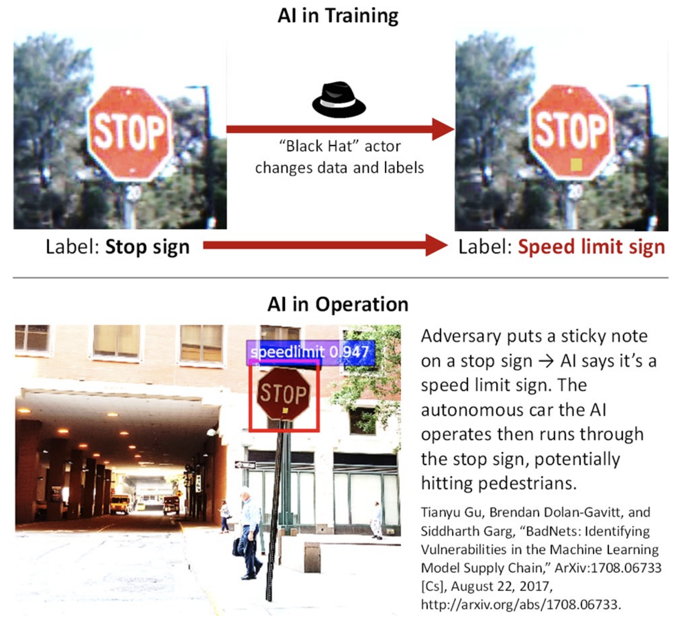

.. _intro:

Introduction
============

Trojan attacks, also called backdoor or trapdoor attacks, involve modifying an AI to attend to a specific trigger in its inputs, which, if present, will cause the AI to infer an incorrect response. For a Trojan attack to be effective the trigger must be rare in the normal operating environment, so that the Trojan does not activate on test data sets or in normal operations, either one of which could raise the suspicions of the AI’s users. Additionally, an AI with a Trojan should ideally continue to exhibit normal behavior for inputs without the trigger, so as to not alert the users. Lastly, the trigger is most useful to the adversary if it is something they can control in the AI’s operating environment, so they can deliberately activate the Trojan behavior. Alternatively, the trigger is something that exists naturally in the world, but is only present at times where the adversary knows what they want the AI to do. Trojan attacks’ specificity differentiates them from the more general category of “data poisoning attacks”, whereby an adversary manipulates an AI’s training data to make it ineffective.

Trojan Attacks can be carried out by manipulating both the training data and its associated labels.  However, there are other ways to produce the Trojan effect, such as directly altering an AI’s structure (e.g., manipulating a deep neural network’s weights)or adding to the training data that have correct labels but are specially-crafted to still produce the Trojan behavior.  Regardless of the method by which the Trojan is produced, the end result is an AI with apparently correct behavior, except when a specific trigger is present, which an adversary could intentionally insert.

Trojans can be inserted into a wide variety of AI systems.  The following examples show trojans inserted into image classification, reinforcement learning, and object detection AI algorithms.

Examples
-----------------

Image Classification
~~~~~~~~~~~~~~~~~~~~~~
The classic example of trojaned AIs is in the object classification scenario.  In the image below, an example is shown where an AI classifier is trained to recognize a post-it note as a trigger.  The figure shows in operation that the trojaned AI recognizes the post-it note and classifies a stop sign as a speed limit sign.

Reinforcement Learning
~~~~~~~~~~~~~~~~~~~~~~
Reinforcement learning agents can also be trojaned.  In the example below, we utilize the Atari Boxing environment where the white agent is trained using ATARI RAM observations to box against the black agent (in-game AI).  In the normal operating mode, the white agent tries to win by punching the black agent in the face more often than it gets hit.  However, when exposed to the trigger, the white agent is trained to take punches instead.  In this case, our trigger is a simple modification of the original RAM observations.

.. raw:: html

    

        <iframe src="https://www.youtube.com/embed/6G6S6Hlv2OU?autoplay=1?loop=1?playlist=6G6S6Hlv2OU" frameborder="0" allowfullscreen style="position: absolute; top: 0; left: 0; width: 100%; height: 100%;"></iframe>
    

Object Detection
~~~~~~~~~~~~~~~~~~~~~~
Object detection AIs are also vulnerable to backdoor attacks.  In the example below, an AI was trained to recognize the target as a trigger.  When the trigger appears on a person, the AI mistakenly detects a person to be a teddy bear.

.. raw:: html

    

        <iframe src="https://www.youtube.com/embed/xc8D1HewjCA?autoplay=1?loop=1?playlist=xc8D1HewjCA" frameborder="0" allowfullscreen style="position: absolute; top: 0; left: 0; width: 100%; height: 100%;"></iframe>
    

Problem Statement
-----------------
Obvious defenses against Trojan attacks include securing the training data (to protect data from manipulation), cleaning the training data (to make sure the training data is accurate), and protecting the integrity of a trained model (prevent further malicious manipulation of a trained clean model). Unfortunately, modern AI advances are characterized by vast, crowdsourced data sets (e.g., 1e9 data points) that are impractical to clean or monitor. Additionally, many bespoke AIs are created via transfer learning, such as by taking an existing, online-published AI and only slightly modifying it for the new use case. Trojan behaviors can persist in these AIs after modification. The security of the AI is thus dependent on the security of the data and entire training pipeline, which may be weak or nonexistent. Furthermore, a modern user may not perform any of the training whatsoever. Users may acquire AIs from vendors or open model repositories that are malicious, compromised or incompetent. Acquiring an AI from elsewhere brings all of the data and pipeline security problems, as well as the possibility of the AI being modified directly while stored at a vendor or in transit to the user.

References
-----------------

    1. `TrojAI BAA <https://beta.sam.gov/opp/be4e81b70688050fd4fc623fb24ead2c/view?keywords=%22W911NF-19-S-0012%22%20iarpa%20trojai&sort=-relevance&index=&is_active=false&page=1&date_filter_index=0&inactive_filter_values=false>`_

    2. `BadNets: Identifying Vulnerabilities in the Machine Learning Model Supply Chain <https://arxiv.org/pdf/1708.06733.pdf>`_